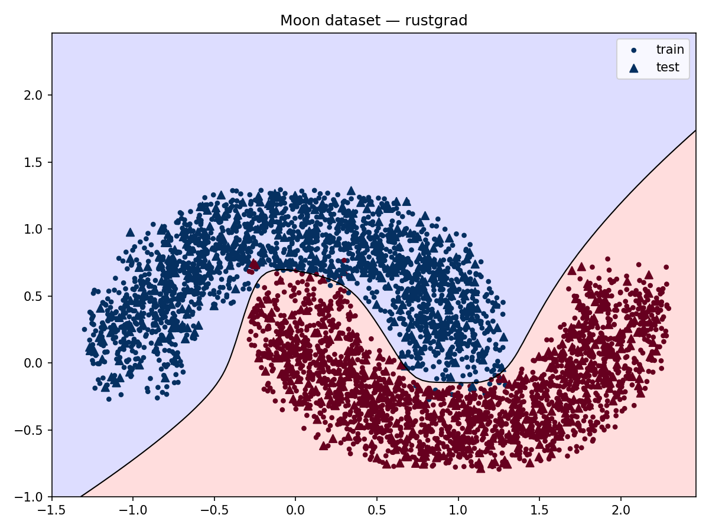

# rustgrad
A tensor-valued autograd engine implemented in Rust, inspired by Karpathy's [micrograd](https://github.com/karpathy/micrograd). Implements reverse-mode automatic differentiation over a dynamically built DAG, with a neural network library on top.

## Features
- Tensor-valued autograd engine with dynamic DAG construction
- Reverse-mode backpropagation via topological sort
- Broadcasting-aware gradient accumulation for binary operations
- Neural network abstractions: `Layer`, `MLP`
- Xavier and He initialization
- Configurable activation functions (`Tanh`, `ReLU`)
- `log_softmax` and `nll_loss` for classification tasks

## Architecture
Each `Tensor` wraps an `Rc<RefCell<TensorInner>>`, allowing shared ownership across the DAG while maintaining interior mutability for gradient accumulation. Backward closures are stored as `Rc<dyn Fn()>` and invoked in reverse topological order during backpropagation.

Tensor
└── Rc<RefCell<TensorInner>>
    ├── data: Array<f64, IxDyn>
    ├── grad: Array<f64, IxDyn>
    ├── backward: Rc<dyn Fn()>
    └── prev: Vec<Tensor>


## Moon Dataset
Trained a `2→32→32→32→1` MLP with `tanh` activations on a binary classification task using the moon dataset (400 points, 80/20 train/test split).

- **Loss**: SVM hinge loss
- **Train accuracy**: 100%
- **Test accuracy**: 100%



## Usage

### Basic example
```rust
use rustgrad::{Mlp, Tensor};
use rustgrad::Init::Xavier;
use rustgrad::Activation::Tanh;

let mlp = Mlp::new(&[2, 16, 16, 1], Xavier, Tanh);
let x = Tensor::from(vec![1.0, -2.0]);
let out = mlp.forward(&x);
```

### Training
```rust
// forward pass
let ypred: Vec<Tensor> = xs.iter().map(|x| mlp.forward(x)).collect();

// hinge loss
let loss = ypred.iter().zip(ys.iter())
    .map(|(yout, ygt)| {
        let target = Tensor::leaf(Array::from_elem((1, 1), *ygt).into_dyn());
        let one = Tensor::leaf(Array::from_elem((1, 1), 1.0).into_dyn());
        one.sub(yout.mul(target)).relu()
    })
    .reduce(|acc, v| acc.add(&v))
    .unwrap();

// backward pass
mlp.zero_grad();
loss.backward();
mlp.update(lr);
```

### Classification with log_softmax
```rust
let logits = mlp.forward(&x_batch);          // [batch, classes]
let log_probs = logits.log_softmax(1);        // [batch, classes]
let loss = log_probs.nll_loss(&targets);      // scalar
```

## Project Structure
```
rustgrad/
├── src/
│   ├── lib.rs              # library root
│   ├── tensor.rs           # Tensor type and autograd engine
│   ├── nn/
│   │   ├── mod.rs
│   │   ├── layer.rs        # Layer
│   │   └── mlp.rs          # MLP
│   └── bin/
│       ├── basic.rs        # basic usage example
│       ├── moon.rs         # moon dataset training
│       └── bigram.rs       # bigram character language model
├── src/bin/plots/
│   ├── plot_moons.py       # plotting script
│   └── moons.png           # decision boundary
└── Cargo.toml
```
